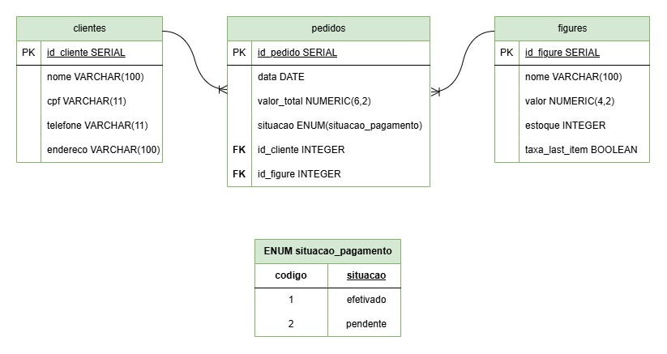

# Geek Store

Sistema desenvolvido para **Geek Store**, com o objetivo de gerenciar o estoque e as vendas de action figures. A plataforma permite o controle dos produtos, clientes e pedidos, oferecendo recursos de pagamento, acompanhamento de encomendas e alertas de estoque, além de destacar produtos que possuem apenas uma unidade disponível.

---

## MER (Modelo Entidade-Relacionamento)

### Entidades e Atributos

#### clientes
- id_cliente SERIAL PRIMARY KEY
- nome VARCHAR(100)
- cpf VARCHAR(11)
- telefone VARCHAR(11)
- endereco VARCHAR(100)

#### pedidos
- id_pedido SERIAL PRIMARY KEY
- data DATE
- valor_total NUMERIC(6,2)
- situacao ENUM(situacao_pagamento)
- id_cliente INTEGER FOREIGN KEY
- id_figure INTEGER FOREIGN KEY

#### figures
- id_figure SERIAL PRIMARY KEY
- nome VARCHAR(100)
- valor NUMERIC(4,2)
- estoque INTEGER
- taxa_last_item BOOLEAN

### Relacionamentos
- 1 cliente realiza N pedidos
- 1 figure está contida em N pedidos

---

## DER (Diagrama Entidade-Relacionamento)

